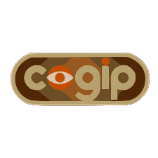
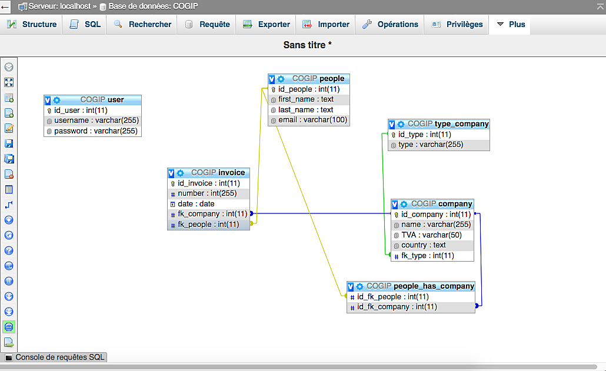

# COGIP

[Repositorie GitHub](https://github.com/MassimoTascone/COGIP) 

## Created by:

[Massimo Tascone](https://github.com/MassimoTascone/) 
[Arturo Solis](https://github.com/artedsolis) 
[Grégoire Wastelain](https://github.com/gwastelain) 

### About:

This site is an exercise for the Johnson 4.14 promotion of BeCode Brussels.

### Missions objectives:

You will find the full instructions of this exercice on this [link](https://github.com/becodeorg/BXL-Johnson-4.14/tree/master/06-PHP/cogip) 

### Mockup:

You will find our Mockup created with Figma on this [link](https://www.figma.com/file/DackgvZAneBaAxynTNDYoK/COGIP---Mockup?node-id=0%3A1)

### Tech:

- HTML
- CSS
- PHP
- MySQL
  Database connections :   

### Ressources:

We used Trello to help us organize our work, you can follow this [link](https://trello.com/b/Nsj0hKhl/cogip-app) 
